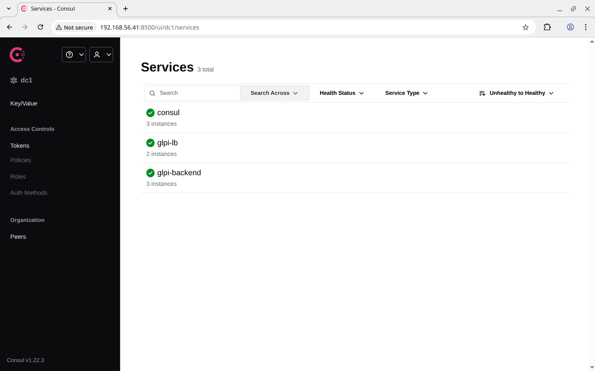
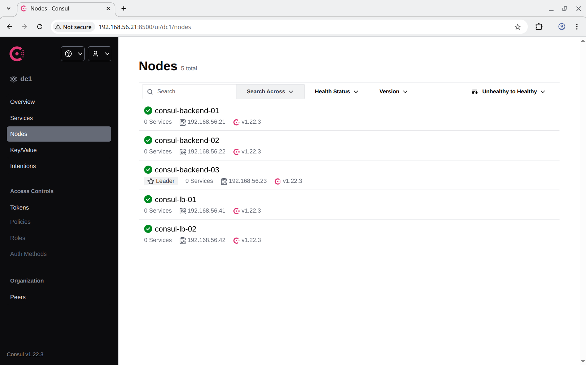
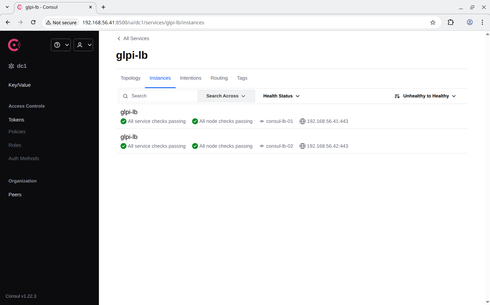
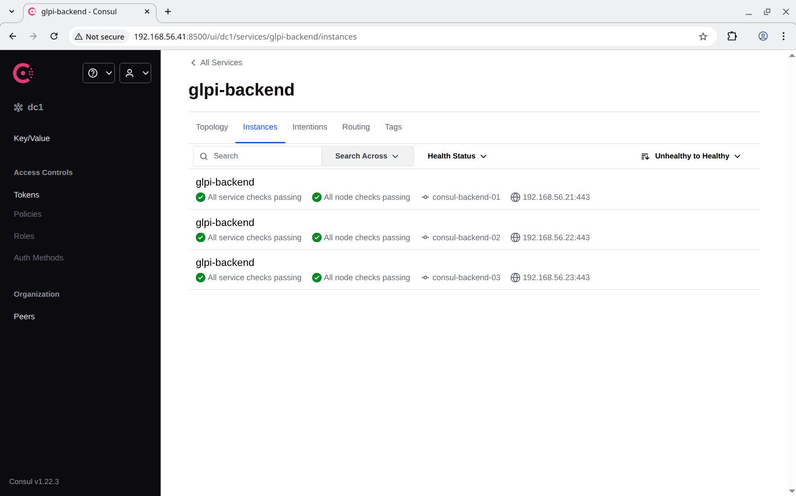
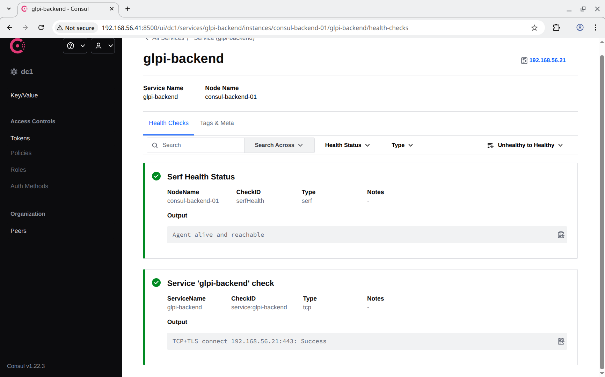
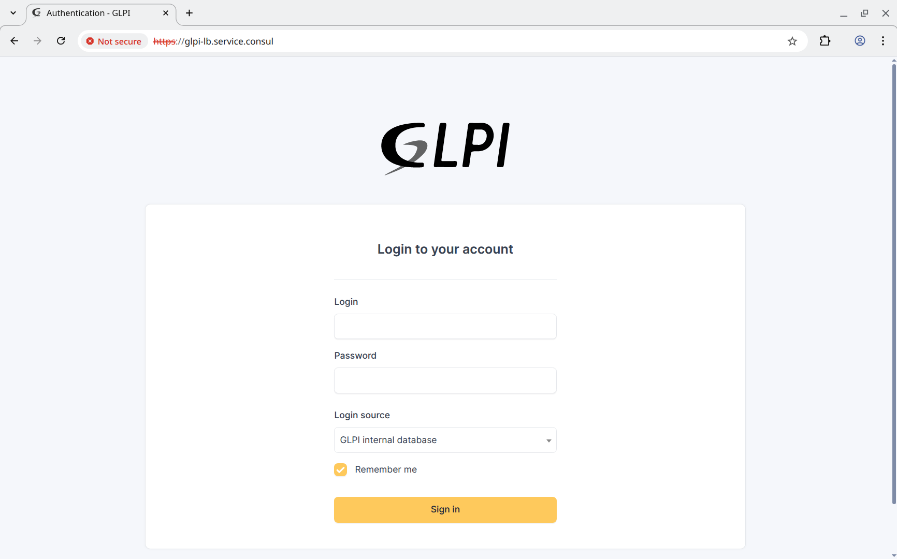
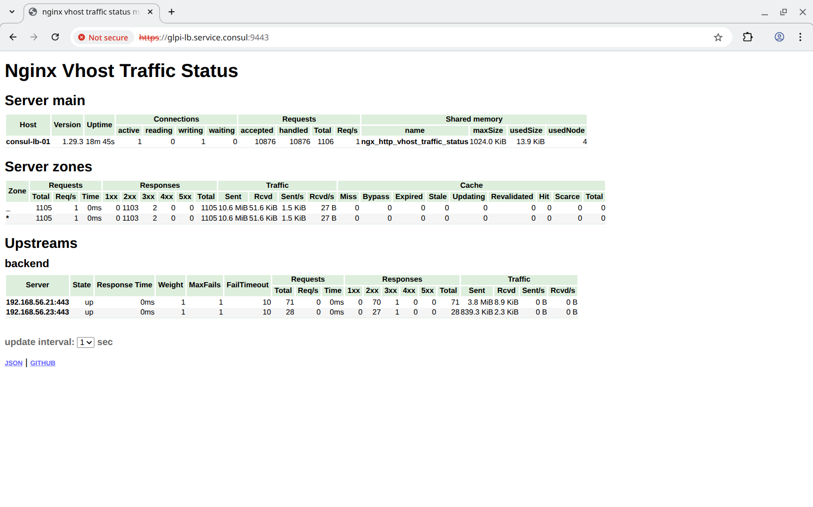

# Consul cluster для service discovery и DNS

## Задание

Настроить **Consul cluster** для управления DNS-записями веб-портала. Реализовать отказоустойчивую балансировку нагрузки через DNS вместо плавающего IP.

1. Развернуть кластер **Consul** (минимум 3 сервера и 1 клиент).
2. Зарегистрировать веб-портал, как сервис в **Consul**.
3. Настроить DNS через **Consul** так, чтобы доменное имя веб-портала разрешалось в IP-адреса его работающих инстансов.
4. Использовать **DNS Consul** для балансировки трафика.
5. Проверить, что при падении одного из веб-серверов его IP больше не выдается в DNS-ответе.

## Реализация

Проект базируется на предудущем проекте [linuxhl10_web](https://github.com/abegorov/linuxhl10_web) (но с заменой **keealived** на **consul**). На узлах **backend** и **lb** поднят **consul** и **angie** на узлах **lb** настроен на балансировку трафика на адрес **glpi-backend.service.consul**, отдаваемый **consule DNS**. Для этого использованы директивы **resolver** и **resolve** в конфигурации **upstream**.

Задание сделано так, чтобы его можно было запустить как в **Vagrant**, так и в **Yandex Cloud**. После запуска происходит развёртывание следующих виртуальных машин:

- **consul-iscsi-01** - сервер **iSCSI target**;
- **consul-iscsi-02** - сервер **iSCSI target**;
- **consul-backend-01** - **GLPI**, клиент файловой системы **GFS2**;
- **consul-backend-02** - **GLPI**, клиент файловой системы **GFS2**;
- **consul-backend-03** - **GLPI**, клиент файловой системы **GFS2**;
- **consul-db-01** - СУБД для работы **GLPI**;
- **consul-lb-01** - **angie** балансировщик для **backend**;
- **consul-lb-02** - **angie** балансировщик для **backend**.

В независимости от того, как созданы виртуальные машины, для их настройки запускается **Ansible Playbook** [provision.yml](provision.yml) который последовательно запускает следующие роли:

- **wait_connection** - ожидает доступность виртуальных машин.
- **apt_sources** - настраивает репозитории для пакетного менеджера **apt** (используется [mirror.yandex.ru](https://mirror.yandex.ru)).
- **bach_completion** - устанавливает пакет **bash-completion**.
- **chrony** - устанавливает **chrony** для синхронизации времени между узлами.
- **hosts** - прописывает адреса всех узлов в `/etc/hosts`.
- **gen_keys** - генерит `/etc/corosync/authkey` для кластера **corosync**.
- **disk_facts** - собирает информацию о дисках и их сигнатурах (с помощью утилит `lsblk` и `wipefs`).
- **disk_label** - разбивает диски и устанавливает на них **GPT Partition Label** для их дальнейшей идентификации.
- **target** - настраивает сервер **iSCSI Target**.
- **linux_modules** - устанавливает модули ядра (в **Yandex Cloud** стоит **linux-virtual**, который не содержит модулей ядра для работы с **GFS2**).
- **iscsi** - настраивает **iSCSI Initiator**.
- **mpath** - настраивает **multipathd**, в частности прописывает **reservation_key** в `/etc/multipath.conf` для последующего использования в агенте **fence_mpath** для настройки **fencing**'а.
- **corosync** - настраивает кластер **corosync** в несколько колец.
- **dlm** - устанавливает распределённый менеджер блокировок **dlm**.
- **mdadm** - устанавилвает **mdadm** и создаёт **RAID1** массив `/dev/md/cluster-md` (используется технология [MD Cluster](https://docs.kernel.org/driver-api/md/md-cluster.html)).
- **lvm_facts** - с помощью утилит **vgs** и **lvs** собирает информацию о группах и томах **lvm**;
- **lvm** - устанавливает **lvm2**, **lvm2-lockd**, создаёт группы томов, сами логические тома и активирует их.
- **gfs2** - устанавливает **gfs2-utils**.
- **filesystem** - форматирует общий диск в файловую систему **GFS2**.
- **directory** - создаёт пустую директорию `/var/lib/glpi`.
- **pacemaker** - устанавливает и настраивается **pacemaker**, который в свою очередь монтирует файловую систему `/dev/cluster-vg/cluster-lv` в `/var/lib/glpi`.
- **angie** - устанавливает и настраивает **angie**;
- **glpi** - устанавиливает и настраивает **glpi**;
- **mariadb** - устанавиливает и настраивает **mariadb**;
- **mariadb_databases** - создаёт базы данных в **mariadb**;
- **mariadb_timezones** - заполняет таблицу **mysql.time_zone_name**, необходимую для работы **mariadb**;
- **mariadb_users** - создаёт пользователей, для подключения к **mariadb**;
- **php_fpm** - устанавиливает и настраивает **php-fpm**;
- **system_groups** - создаёт группы пользователей в системе (в частности для **glpi**);
- **system_users** - создаёт пользователей в системе (в частности для **glpi**);
- **tls_ca** - создаёт сертификаты для корневых центров сертификации;
- **tls_certs** - создаёт сертификаты для узлов;
- **tls_copy** - копирует серитификаты на узел.

Данные роли настраиваются с помощью переменных, определённых в следующих файлах:

- [group_vars/all/angie.yml](group_vars/all/angie.yml) - общие настройки **angie** для узлов **backend** и **lb**;
- [group_vars/all/ansible.yml](group_vars/all/ansible.yml) - общие переменные **ansible** для всех узлов;
- [group_vars/all/certs.yml](group_vars/all/certs.yml) - настройки генерации сертификатов для СУБД и **angie**;
- [group_vars/all/consul.yml](group_vars/all/consul.yml) - общие настройки **consul**;
- [group_vars/all/glpi.yml](group_vars/all/glpi.yml) - общие настройки **GLPI**;
- [group_vars/all/hosts.yml](group_vars/all/hosts.yml) - настройки для роли **hosts** (список узлов, которые нужно добавить в `/etc/hosts`);
- [group_vars/all/iscsi.yml](group_vars/all/iscsi.yml) - общие настройки для **iSCSI Target** и **iSCSI Initiator**;
- [group_vars/backend/angie.yml](group_vars/backend/angie.yml) - настройки **angie** для узлов **backend**;
- [group_vars/backend/certs.yml](group_vars/backend/certs.yml) - настройки генерации сертификатов для **backend**;
- [group_vars/backend/consul.yml](group_vars/backend/consul.yml) - настройки **consul** для **backend**;
- [group_vars/backend/corosync.yml](group_vars/backend/corosync.yml) - настройки **corosync**;
- [group_vars/backend/gfs2.yml](group_vars/backend/gfs2.yml) - настройки **MD Cluster**, **LVM**, **GFS2**;
- [group_vars/backend/glpi.yml](group_vars/backend/glpi.yml) - настройки **GLPI** для **backend**;
- [group_vars/backend/iscsi.yml](group_vars/backend/iscsi.yml) - настройки **iSCSI Initiator**;
- [group_vars/backend/php.yml](group_vars/backend/php.yml) - настройки **PHP** для **backend**;
- [group_vars/backend/users.yml](group_vars/backend/users.yml) - настройки создания пользователей и групп на узлах **backend**;
- [group_vars/db/certs.yml](group_vars/backend/certs.yml) - настройки генерации сертификатов для СУБД;
- [group_vars/db/mariadb.yml](group_vars/backend/mariadb.yml) - настройки **mariadb**;
- [group_vars/iscsi/iscsi.yml](group_vars/iscsi/iscsi.yml) - настройки **iSCSI Target**;
- [group_vars/lb/angie.yml](group_vars/lb/angie.yml) - настройки **angie** для узлов **lb**;
- [group_vars/lb/certs.yml](group_vars/lb/certs.yml) - настройки генерации сертификатов для **lb**;
- [group_vars/lb/consul.yml](group_vars/lb/consul.yml) - настройки **consul** для **lb**;
- [group_vars/lb/nftables.yml](group_vars/lb/nftables.yml) - настройки **nftables** для **lb** (перенаправление порта 53 (DNS) на 8600 (consul DNS));
- [host_vars/consul-backend-01/gfs2.yml](host_vars/consul-backend-01/gfs2.yml) - настройки создания **MD Cluster**, **LVM**, **GFS2**;
- [host_vars/consul-backend-01/pacemaker.yml](host_vars/consul-backend-01/pacemaker.yml) - настройки **pacemaker**.

## Запуск

### Запуск в Yandex Cloud

1. Необходимо установить и настроить утилиту **yc** по инструкции [Начало работы с интерфейсом командной строки](https://yandex.cloud/ru/docs/cli/quickstart).
2. Необходимо установить **Terraform** по инструкции [Начало работы с Terraform](https://yandex.cloud/ru/docs/tutorials/infrastructure-management/terraform-quickstart).
3. Необходимо установить **Ansible**.
4. Необходимо перейти в папку проекта и запустить скрипт [up.sh](up.sh).

### Запуск в Vagrant (VirtualBox)

Необходимо скачать **VagrantBox** для **bento/ubuntu-24.04** версии **202510.26.0** и добавить его в **Vagrant** под именем **bento/ubuntu-24.04/202510.26.0**. Сделать это можно командами:

```shell
curl -OL https://app.vagrantup.com/bento/boxes/ubuntu-24.04/versions/202510.26.0/providers/virtualbox/amd64/vagrant.box
vagrant box add vagrant.box --name "bento/ubuntu-24.04/202510.26.0"
rm vagrant.box
```

После этого нужно сделать **vagrant up** в папке проекта.

## Проверка

Протестировано в **OpenSUSE Tumbleweed**:

- **Vagrant 2.4.9**
- **VirtualBox 7.2.4_SUSE r170995**
- **Ansible 2.20.2**
- **Python 3.13.11**
- **Jinja2 3.1.6**
- **Terraform 1.14.3**

Проверим, что **consul** работает нормально:

```text
root@consul-lb-01:~# consul version
Consul v1.22.3
Revision cc9bcd61
Build Date 2026-01-14T14:52:07Z
Protocol 2 spoken by default, understands 2 to 3 (agent will automatically use protocol >2 when speaking to compatible agents)

root@consul-lb-01:~# consul members
Node               Address             Status  Type    Build   Protocol  DC   Partition  Segment
consul-backend-01  192.168.56.21:8301  alive   server  1.22.3  2         dc1  default    <all>
consul-backend-02  192.168.56.22:8301  alive   server  1.22.3  2         dc1  default    <all>
consul-backend-03  192.168.56.23:8301  alive   server  1.22.3  2         dc1  default    <all>
consul-lb-01       192.168.56.41:8301  alive   client  1.22.3  2         dc1  default    <default>
consul-lb-02       192.168.56.42:8301  alive   client  1.22.3  2         dc1  default    <default>

root@consul-lb-01:~# consul operator raft list-peers
Node               ID                                    Address             State     Voter  RaftProtocol  Commit Index  Trails Leader By
consul-backend-02  7838423f-b817-8220-73d1-61f6e0790161  192.168.56.22:8300  follower  true   3             3735          0 commits
consul-backend-03  4c32a001-ac89-a334-9aa4-97ab2a265c11  192.168.56.23:8300  leader    true   3             3735          -
consul-backend-01  97b219e4-2067-ac70-f48d-5b184792a27c  192.168.56.21:8300  follower  true   3             3735          0 commits

```

Проверим регистрацию сервисов и работу **consul DNS**, отправив **DNS** запросы на узел **consul-lb-01**:

```text
❯ dig +noall +answer +add @192.168.56.41 glpi-lb.service.consul
glpi-lb.service.consul. 0       IN      A       192.168.56.42
glpi-lb.service.consul. 0       IN      A       192.168.56.41

❯ dig +noall +answer +add @192.168.56.41 glpi-lb.service.consul SRV
glpi-lb.service.consul. 0       IN      SRV     1 1 443 c0a8382a.addr.dc1.consul.
glpi-lb.service.consul. 0       IN      SRV     1 1 443 c0a83829.addr.dc1.consul.
c0a8382a.addr.dc1.consul. 0     IN      A       192.168.56.42
consul-lb-02.node.dc1.consul. 0 IN      TXT     "consul-version=1.22.3"
consul-lb-02.node.dc1.consul. 0 IN      TXT     "consul-network-segment="
c0a83829.addr.dc1.consul. 0     IN      A       192.168.56.41
consul-lb-01.node.dc1.consul. 0 IN      TXT     "consul-network-segment="
consul-lb-01.node.dc1.consul. 0 IN      TXT     "consul-version=1.22.3"

❯ dig +noall +answer +add @192.168.56.41 glpi-backend.service.consul
glpi-backend.service.consul. 0  IN      A       192.168.56.23
glpi-backend.service.consul. 0  IN      A       192.168.56.22
glpi-backend.service.consul. 0  IN      A       192.168.56.21

❯ dig +noall +answer +add @192.168.56.41 glpi-backend.service.consul SRV
glpi-backend.service.consul. 0  IN      SRV     1 1 443 c0a83816.addr.dc1.consul.
glpi-backend.service.consul. 0  IN      SRV     1 1 443 c0a83817.addr.dc1.consul.
glpi-backend.service.consul. 0  IN      SRV     1 1 443 c0a83815.addr.dc1.consul.
c0a83816.addr.dc1.consul. 0     IN      A       192.168.56.22
consul-backend-02.node.dc1.consul. 0 IN TXT     "consul-version=1.22.3"
consul-backend-02.node.dc1.consul. 0 IN TXT     "consul-network-segment="
c0a83817.addr.dc1.consul. 0     IN      A       192.168.56.23
consul-backend-03.node.dc1.consul. 0 IN TXT     "consul-version=1.22.3"
consul-backend-03.node.dc1.consul. 0 IN TXT     "consul-network-segment="
c0a83815.addr.dc1.consul. 0     IN      A       192.168.56.21
consul-backend-01.node.dc1.consul. 0 IN TXT     "consul-network-segment="
consul-backend-01.node.dc1.consul. 0 IN TXT     "consul-version=1.22.3"

```

Проверим, что **consul** также разрешает внешние DNS имена (в конфигурации указана опция **recursors**):

```text
❯ dig +noall +answer +add @192.168.56.41 www.yandex.ru
www.yandex.ru.          155     IN      A       77.88.44.55
www.yandex.ru.          155     IN      A       77.88.55.88
www.yandex.ru.          155     IN      A       5.255.255.77

```

На порту 8500 также доступен **web** интерфейс **consul**:



Кластер **consul** состоит из 3-х узлов и 2-х клиентов:



Настроено 2 сервиса **glpi-lb** и **glpi-backend**:




Для обоих сервисов настроен **tcp healthcheck** с поддержкой **TLS**:



Для того, чтобы зайти на узел необходимо поправить настройки **DNS** на клиенте (например `/etc/resolv.conf`):

```text
nameserver 192.168.56.41
```

После этого можно зайти на узел по адресу [glpi-lb.service.consul](https://glpi-lb.service.consul):



Погасим **angie** на **consul-lb-02** и **consul-backend-02**:

```text
❯ vagrant ssh consul-lb-02 -c 'sudo systemctl stop angie'

❯ vagrant ssh consul-backend-01 -c 'sudo pcs resource ban angie-clone consul-backend-02'
Warning: Creating location constraint 'cli-ban-angie-clone-on-consul-backend-02' with a score of -INFINITY for resource angie-clone on consul-backend-02.
        This will prevent angie-clone from running on consul-backend-02 until the constraint is removed
        This will be the case even if consul-backend-02 is the last node in the cluster

```

Погашенные сервисы исчезли из **DNS**:

```text
❯ dig +noall +answer +add @192.168.56.41 glpi-lb.service.consul
glpi-lb.service.consul. 0       IN      A       192.168.56.41

❯ dig +noall +answer +add @192.168.56.41 glpi-backend.service.consul
glpi-backend.service.consul. 0  IN      A       192.168.56.23
glpi-backend.service.consul. 0  IN      A       192.168.56.21

```

Проверим также **VTS** плагин в **angie**:



Вернём сервисы и проверим **DNS** записи:

```text
❯ vagrant ssh consul-lb-02 -c 'sudo systemctl start angie'

❯ vagrant ssh consul-backend-01 -c 'sudo pcs resource clear angie-clone consul-backend-02'
Removing constraint: cli-ban-angie-clone-on-consul-backend-02

❯ dig +noall +answer +add @192.168.56.41 glpi-lb.service.consul
glpi-lb.service.consul. 0       IN      A       192.168.56.41
glpi-lb.service.consul. 0       IN      A       192.168.56.42

❯ dig +noall +answer +add @192.168.56.41 glpi-backend.service.consul
glpi-backend.service.consul. 0  IN      A       192.168.56.23
glpi-backend.service.consul. 0  IN      A       192.168.56.21
glpi-backend.service.consul. 0  IN      A       192.168.56.22

```
